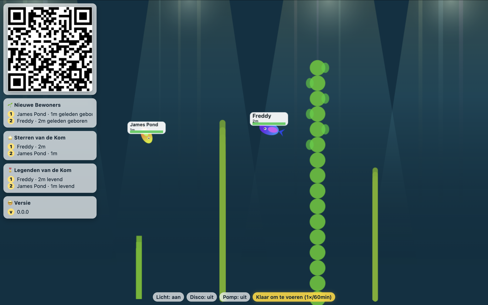

# Vissenkom



Virtuele vissenkom met remote control. Scan de QR-code met je telefoon (max. 1 uur geldig) en voeg vissen toe, geef ze voer, bedien het licht en de pomp, maak de kom schoon, etc.

## ⚠️ Waarschuwing

Dit project is volledig gemaakt met AI. Eerlijk gezegd weet ik niet precies wat er op de achtergrond gebeurt. Gebruik op eigen risico.
## Setup

1. Installeer dependencies:
```
npm install
```

2. Start de server:
```
npm start
```

3. Open je browser:

Ga naar http://localhost:3000

## Configuratie (optioneel)

De applicatie werkt direct zonder configuratie. Als je de footer in de controller wilt aanpassen, kopieer dan `config.example.json` naar `config.json` en pas de waarden aan:

```bash
cp config.example.json config.json
```

Beschikbare opties:
- `footerText`: Tekst in de footer (bijv. "Powered by Vissenkom")
- `footerLink`: URL waar de footer naartoe linkt (optioneel)
