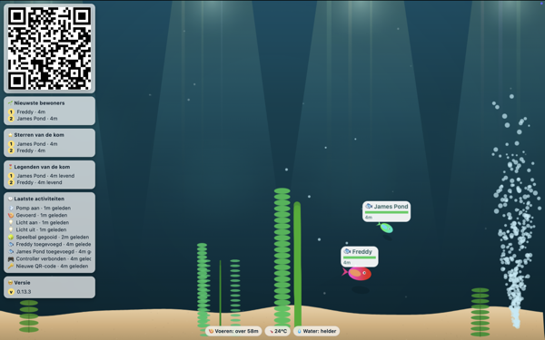
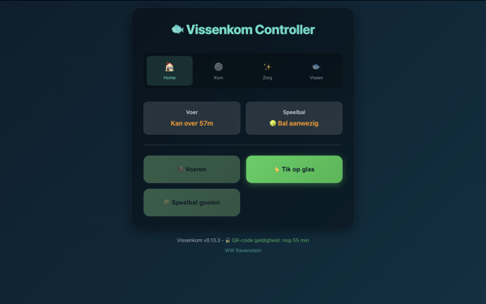

# Vissenkom

 

Een virtuele vissenkom op je scherm. Voeg vissen toe, geef ze eten, speel met ze en houd ze in leven. Bedien alles via je telefoon.

- [Hoe werkt het?](#hoe-werkt-het)
- [Lokaal draaien](#lokaal-draaien)
- [Zelf hosten](#zelf-hosten)
- [Configuratie (optioneel)](#configuratie-optioneel)
- [Credits](#credits)

## Hoe werkt het?

### Introductie

Vissenkom bestaat uit drie onderdelen: een server (draait op de achtergrond), een display (de vissenkom zelf) en een controller (de afstandsbediening). Het display draait op (maximaal) één apparaat en toont de kom met een QR-code. Scan de code met je telefoon om de controller te openen en acties uit te voeren. De QR-code is maximaal één uur geldig — daarna moet je terug naar de kom om hem opnieuw te scannen.

### Ecosysteem

Vissen leven in de kom en moeten eten om in leven te blijven. Ze kunnen ziek worden en elkaar besmetten, dus genees ze op tijd door medicijnen te geven. De omgeving (zoals temperatuur, pomp en andere factoren) heeft invloed op hun gezondheid en gedrag.

Vissen vertonen uiteenlopend gedrag:
- **Schooling**: samenzwemmen met andere vissen
- **Jagen**: achtervolgen van andere vissen
- **Territoriaal**: een gebied verdedigen tegen indringers
- **Bodem zwemmen**: rondhangen bij de bodem
- **Muren volgen**: zwemmen langs de wanden van de kom
- **Rusten**: even stilhangen
- **Dansen**: enthousiast zwemmen (vooral tijdens discomodus)
- **Speels**: rondspringen en dartelen
- **Nieuwsgierig**: interesse tonen in de pomp of andere objecten
- **Verbergen**: schuilen achter decoratie
- **Drijven**: lui aan het oppervlak hangen
- **Springen**: energiek op en neer

### Interactie

Via de controller kan je o.a.:
- **Vissen toevoegen**: voeg nieuwe vissen toe aan de kom
- **Voer geven**: houd je vissen in leven
- **Medicijnen toedienen**: genees zieke vissen
- **Pomp aan- / uitzetten**: regel de watercirculatie
- **Verwarming aan- / uitzetten**: pas de watertemperatuur aan
- **Tikken op de kom**: laat de vissen schrikken
- **Hengel**: gooi een hengeltje uit en probeer een vis te vangen
- **Speelbal**: gooi een bal in het water waar vissen mee kunnen spelen
- **Discomodus**: feestverlichting

## Lokaal draaien

1. Clone project:
```
git clone https://github.com/rickvanderwolk/vissenkom.git
```

2. Ga naar de map:
```
cd vissenkom
```

3. Installeer dependencies:
```
npm install
```

4. Start de server:
```
npm start
```

5. Open je browser:

Ga naar http://localhost:3000

## Zelf hosten

Je kunt een vissenkom op je eigen server draaien. Hiervoor heb je Node en NPM nodig. Wil je snel starten? Hieronder staat hoe je in een paar minuten een vissenkom opzet met Railway.

[](https://railway.com/deploy/YlW9Ln)

1. Deploy: Klik op de knop hierboven (login of maak een account aan en klik op deploy)
2. Maak beschikbaar via internet: Na deployment, ga naar je service → **Settings** → **Networking** → **Generate Domain**
3. (Optioneel) Persistente data: Data blijft standaard niet bewaard bij een nieuwe deploy, waardoor vissen en andere data verloren gaan. Om data tussen (re)deploys te behouden, ga je naar je project canvas, rechtermuisklik op het canvas → **New Volume** → selecteer je service → mount path `/data`
4. Open de vissenkom: Open de gegenereerde URL in je browser

Gratis tier beschikbaar (~500 uur/maand). Daarna ongeveer $5 per maand om continu te draaien.

## Configuratie (optioneel)

De applicatie werkt direct zonder configuratie. Wil je het display of de controller aanpassen? Kopieer dan `config.example.json` naar `config.json` en pas de waarden aan:

```bash
cp config.example.json config.json
```

Beschikbare opties:

| Optie | Beschrijving | Standaard |
|-------|-------------|-----------|
| `theme` | Thema van de vissenkom. Opties: `null` (automatisch op basis van seizoen), `normal`, `spring`, `summer`, `autumn`, `winter`, `tropical`, `arctic`, `halloween`, `christmas` | `null` |
| `showFooter` | Toon de footer in de controller | `true` |
| `footerLink` | URL waar de footer naartoe linkt | `https://github.com/rickvanderwolk/vissenkom` |
| `footerLinkText` | Tekst van de link in de footer | `View on GitHub` |
| `showBehaviorEmoji` | Toon emoji's bij vissen die hun huidige gedrag weergeven (bijv. dansen, rusten, schooling) | `true` |
| `showControllerStatusBlocks` | Toon statusblokken in de controller (temperatuur, pomp, etc.) | `false` |
| `viewport` | Object met `offsetTop`, `offsetBottom`, `offsetLeft`, `offsetRight` om het zichtbare gebied aan te passen (handig voor schermen met randen) | `0` voor alle waarden |

## Credits

Geluidseffecten:
- Bell notification sound via [Pixabay](https://pixabay.com/sound-effects/bell-notification-337658/)
